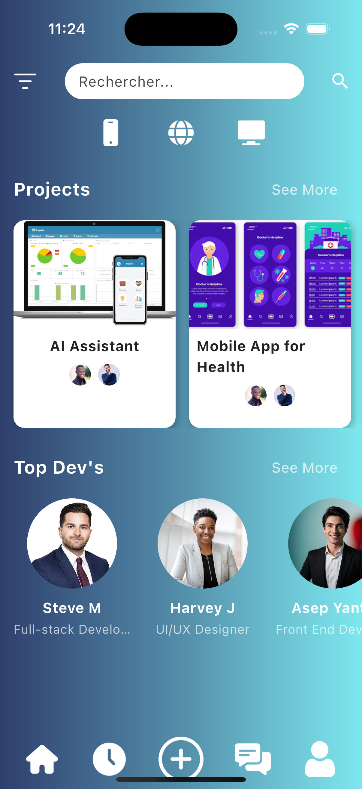
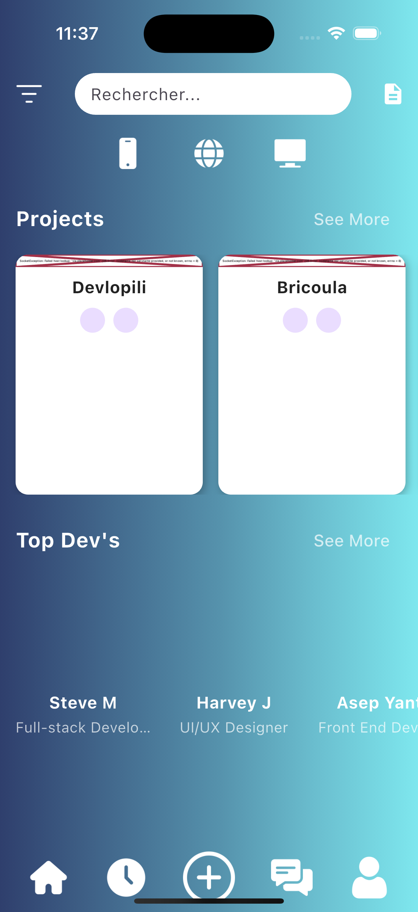
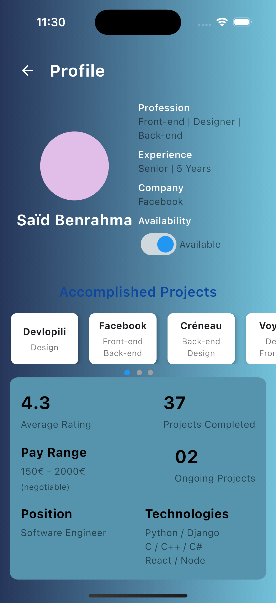
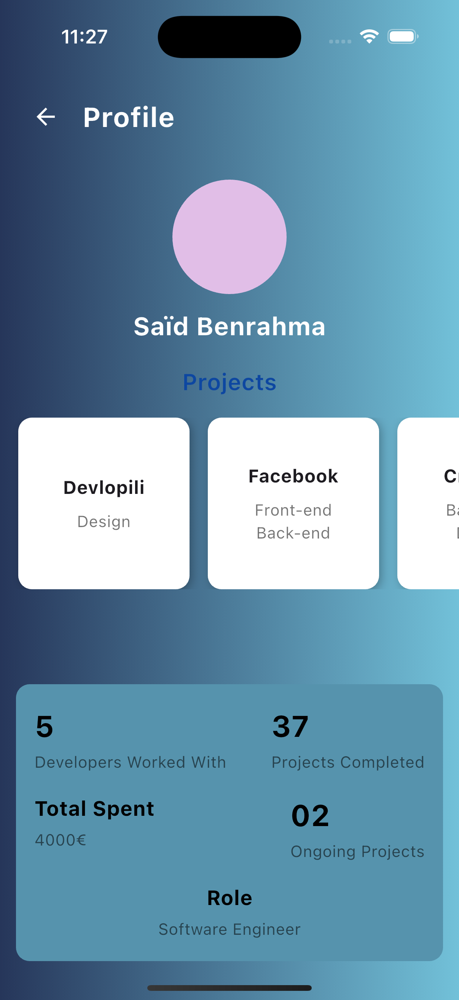
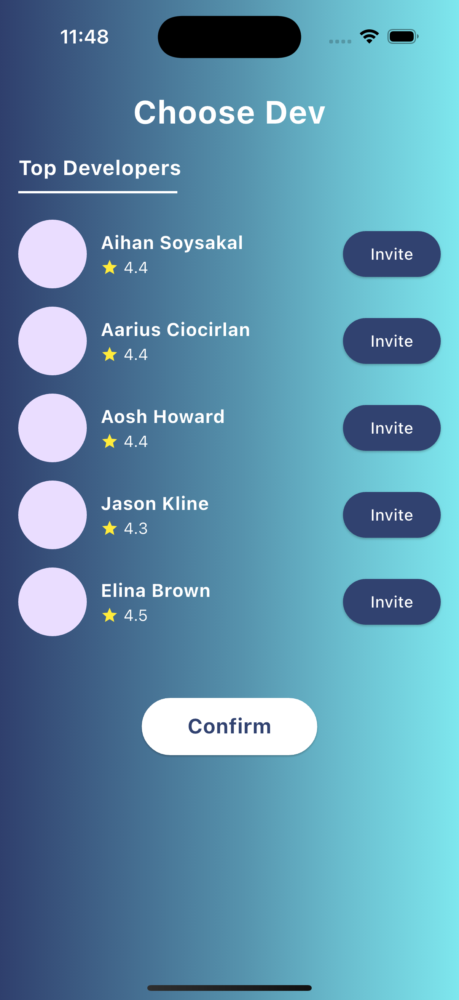
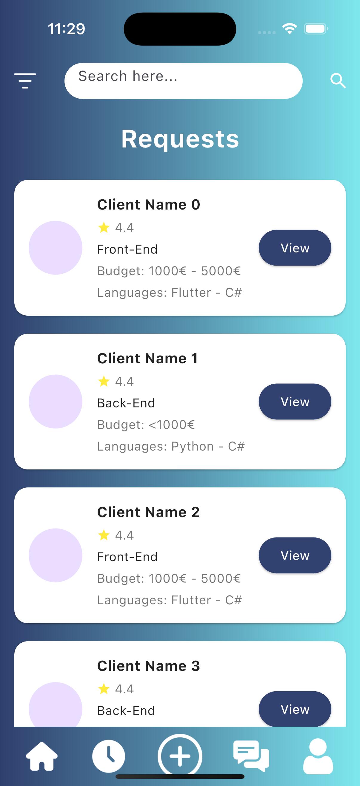
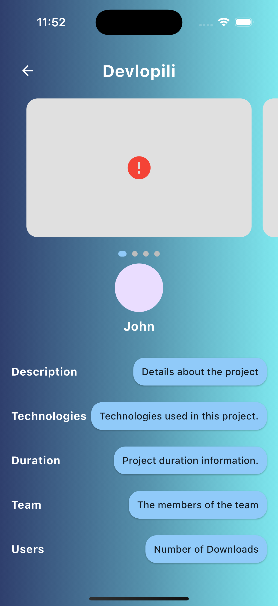
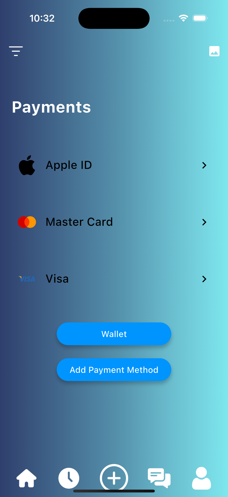

# Software Requirements Specification For DevSpace

## Version <0.0>

## Prepared by :

1- Ouadahi Mohand Belkacem mohandbelkacemouadahi@gmail.com
2- Laouadi Younes
3- Hamma Anes anesjob70@gmail.com
4- Djenkal Amine amindjenkal@gmail.com

### Instructor:

Berghout Yasser

### Course:

Software Engineering

### Date:

January 13th 2025

# Table of Contents

## 1. Introduction

### 1.1 Purpose

### 1.2 Document Conventions

### 1.3 Intended Audience and Reading Suggestions

### 1.4 Product Scope

### 1.5 References

## 2. Overall Description

### 2.1 Product Overview

### 2.2 Product Functionality

### 2.3 Design and Implementation Constraints

### 2.4 Assumptions and Dependencies

## 3. Specific Requirements

### 3.1 External Interface Requirements

### 3.2 Functional Requirements

### 3.3 Use Case Model

## 4. Other Nonfunctional Requirements

### 4.1 Performance Requirements

### 4.2 Safety and Security Requirements

### 4.3 Software Quality Attributes

# 1. Introduction

## 1.1 Purpose

The purpose of this mobile application is to create a seamless connection between clients and developers by addressing common challenges and misunderstandings that often arise during software development projects. The app simplifies the process of defining project requirements by guiding clients, including those with little or no experience in development, through a set of questions to generate a detailed Software Requirements Specification (SRS) file.

Additionally, the application leverages AI to recommend the most suitable developers based on various factors such as budget, preferences, work mentality, time management skills, and project requirements. By providing both clients and developers with an efficient and user-friendly platform, the app aims to foster more successful collaborations and ensure a better alignment of expectations throughout the project lifecycle.

## 1.2 Document Conventions

This Document was created based on the IEEE template for System Requirement Specification Documents.

## 1.3 Intended Audience and Reading Suggestions

- Software Developers (All Levels): Junior, Mid-Level, Senior.
- Clients :
- **Non-Technical Clients** : Individuals or businesses with little to no experience in software development who will use the app to generate SRS files easily and find suitable developers.
- **First-Time Clients** : Clients new to working with developers and seeking guidance on how to define project requirements and collaborate effectively.
- **Businesses/Organizations** : Companies looking to find developers that align with their project needs, budget, and preferences.

## 1.4 Product Scope

**Devlopili** is a mobile application designed to streamline the process of connecting clients and developers in the software development industry. The application aims to eliminate common misunderstandings and issues by guiding both parties through a set of structured questions that help define project requirements and preferences. The scope of the project includes the following

## 1.5 References

- IEEE Std 830-1998, IEEE Recommended Practice for Software Requirements Specifications.

# 2. Overall Description

## 2.1 Product Overview

**Devlopili** is a standalone mobile application designed to address a common pain point in the software development industry—bridging the gap between clients and developers. The app is unique in its approach, using AI to facilitate the creation of Software Requirements Specifications (SRS) and to recommend suitable developers based on client needs.

## 2.2 Product Functionality

### Functionalities:

- General Considerations:

  **1. SRS Generation** :

  • **Client Questionnaire** : Clients will answer a series of guided questions that will help define the scope and requirements of their project. These questions will cover aspects such as project type, preferred technologies, budget, timeline, and specific goals.

  • **AI-Powered SRS Creation** : Based on the client’s responses, the system will automatically generate a comprehensive Software Requirements Specification (SRS) document. This document will clearly outline project goals, functionalities, constraints, and deliverables.

  **2.** **Developer Profile Management** :

  • **Developer Registration** : Developers will create profiles that highlight their skills, experience, areas of expertise, and past projects. They will be able to update their profile information and add new certifications or completed projects.

  • **Profile Customization** : Developers can customize their profiles based on the types of projects they are best suited for (e.g., web development, mobile development, AI, etc.).

  **3.** **Developer Recommendation System** :

  • **AI-Based Matching** : The app will use an AI model to recommend developers to clients based on various criteria, including:

  •Budget compatibility

  •Developer expertise and skills

  •Availability and time management

  •Work mentality and previous project success

  • **Client-Developer Compatibility Score** : The app will assign a compatibility score to each developer-client pair based on how well their preferences, budgets, and project requirements align.

  **4.** **Project Management and Communication** :

  • **Project Timeline** : Clients and developers will be able to set milestones, deadlines, and track the progress of the project from within the app.

  • **In-App Communication** : The app will provide tools for clients and developers to communicate securely, discuss project details, share files, and provide updates.

  **5.** **User Profile Management** :

  • **Client Profile** : Clients will be able to create and manage their profiles, detailing their project requirements, budget, and preferences. This information will help the system generate personalized recommendations and SRS files.

  • **Preferences Customization** : Both clients and developers can customize preferences regarding communication methods, project timelines, and task management approaches.

  **6.** **User Feedback and Ratings** :

  • **Developer Feedback** : After completing a project, clients will have the ability to leave feedback and ratings for the developer based on their experience. This feedback will help improve future recommendations.

  • **Client Feedback** : Developers can also rate clients based on their communication, project management, and overall collaboration.

  **7.** **Security and Data Privacy** :

  • **Secure Login and Authentication** : Users (both clients and developers) will be required to log in with secure authentication methods, such as email verification or two-factor authentication.

  • **Data Privacy** : All user data, including project details, personal information, and financial data, will be encrypted and stored securely to ensure privacy and compliance with data protection regulations.

  **8.** **Push Notifications** :

  • **Project Updates** : Users will receive notifications about project milestones, deadlines, and updates from their respective clients or developers.

  • **Recommendation Alerts** : Clients will be notified when new developer recommendations are available based on their project specifications.

- **Authentication & Security**:

  - Implements secure user authentication and data encryption to protect sensitive information such as password.

- **Notifications**:

  - Integrates a push notification system for real-time (e.g., new messages, code reviews, ratings).

- **Chat**:

  - Stores chat history in a database for persistence.

- **Home**:

  - Display the user collaborative project and suggests the available Developers.

## 2.3 Design and Implementation Constraints

**Mobile Development Framework** : The app is developed using **Flutter** for cross-platform compatibility, targeting both Android and iOS platforms. This imposes some limitations on the use of platform-specific features and might require additional adjustments for each platform’s unique capabilities.

• **Database** : The application uses **PostgreSQL** for data storage. While PostgreSQL is highly reliable and scalable, it requires careful database design to ensure efficient queries, especially with large volumes of data like user profiles and project details.

• **Backend Framework** : The backend is implemented using **Django** , which is a robust and secure web framework. However, the design and implementation of Django-based APIs and integration with Flutter might require additional effort in adapting to the specific needs of a mobile app.

• **SQL Database** : The use of **SQL** for database management may impose some constraints in handling complex, highly interconnected data. Careful normalization and query optimization will be necessary to ensure the system can scale efficiently.

• **Cloud Hosting** : The backend infrastructure is hosted on a cloud platform (AWS, Google Cloud, or Microsoft Azure). While cloud hosting offers scalability, it also introduces dependency on the availability and performance of third-party cloud providers.

• **Data Security** : The application will handle sensitive user data, which will require encryption and adherence to privacy regulations (e.g., GDPR). Implementing robust security measures, particularly for user authentication and data storage, will be critical.

• **Third-Party Integrations** : Integrating with third-party services like payment processors (Stripe, PayPal) and push notification services (Firebase, APNs) introduces external dependencies that need to be managed for reliability and performance.

## 2.4 Assumptions and Dependencies

### **Assumptions**

1. **Client and Developer Interaction** :

•It is assumed that clients will have a basic understanding of the project they want to develop, even if they are not familiar with the development process. The SRS questionnaire will be designed in such a way that it guides them through the necessary questions.

•Developers are expected to have varying levels of experience with different types of projects and may need to customize their responses in the profile creation to accurately reflect their expertise.

**2** **AI Recommendations** :

•The AI model responsible for matching clients with developers will rely on accurate and complete data from both the clients and the developers, which may include profile details, preferences, project scope, and budget.

**3.** **Internet Connectivity** :

•It is assumed that users (clients and developers) will have access to a stable internet connection for the app to function smoothly, particularly for real-time communication, profile creation, and project updates.

**4.** **User Engagement** :

•Clients and developers are expected to engage actively in the profile creation process and complete the questionnaire with accurate and honest information to ensure meaningful AI-driven recommendations.

**5.** **Third-Party Services** :

•The app will depend on third-party services for push notifications, chat messaging, and AI model functionality, assuming that these services are available and reliable during the use of the app.

**6.** **Mobile App Performance** :

•It is assumed that users will use the app on compatible mobile devices (smartphones or tablets with adequate specifications) for optimal performance.

**7.** **Security and Privacy** :

•The app will ensure data protection by using secure encryption methods and comply with relevant data privacy regulations, such as GDPR.

### **Dependencies**

1.**Software Dependencies** :

• **Flutter** : The app is built using the Flutter framework, which must be installed and correctly configured for development and maintenance.

• **Django** : The backend server and API are built using the Django framework. It requires a working Python environment, along with any necessary libraries and dependencies.

• **PostgreSQL** : The app’s data will be stored in a PostgreSQL database, which must be configured and running on the backend server.

• **SQL** : The app uses SQL queries to interact with the PostgreSQL database for data retrieval, storage, and management.

**2.** **External API and Services** :

• **Push Notification Service** : The app relies on a push notification service (such as Firebase Cloud Messaging) to send real-time notifications about invitations and responses.

• **AI Models** : The AI-driven recommendations for matching developers with clients depend on machine learning models, which may need periodic updates and improvements.

• **Real-time Chat** : A third-party messaging service will be used to facilitate real-time chat between clients and developers.

**3.** **Hardware and Devices** :

• **Mobile Devices** : The app must be compatible with a range of mobile devices (iOS and Android). This dependency requires the app to be tested on various devices to ensure compatibility.

**4.** **Cloud Hosting** :

•The app’s backend and database are hosted on cloud platforms, which must be available and meet the app’s performance, scalability, and reliability requirements.

**5.** **User Profiles** :

•The quality of the AI’s recommendations depends heavily on the accurate and detailed input provided by both clients and developers. Therefore, the app assumes that users will fully complete their profiles with the necessary information.

## 3.1 External Interface Requirements

### 3.1.1 User Interfaces

- Home Page Client :

  

  
- Home Page Developer :

  

- Developer Profile :

  

- Client Profile :

  

- Developer Proposition :

  

- Client Requests :

  
- Project Page :

  

- Payements :

  

## 3.2 Functional Requirements

1. User Account Management
   • FR1.1: The app must allow users (both clients and developers) to create an account with a unique email and password.
   • FR1.2: Users must be able to log in using their credentials or social media accounts (Google/Facebook) if available.
   • FR1.3: Users must have the ability to reset their password if forgotten.
   • FR1.4: The app must validate the user’s email and phone number for authentication.
2. Profile Creation
   • FR2.1: Clients must be able to create a profile by filling out personal information, including name, contact details, and project preferences.
   • FR2.2: Developers must be able to create a profile by providing their name, contact details, skills, experience, and project preferences.
   • FR2.3: Both clients and developers must be able to update their profiles at any time, including their personal information and preferences.
   • FR2.4: Developers must be able to upload a portfolio or showcase their previous work.
3. SRS Questionnaire and Generation
   • FR3.1: Clients must be able to fill out an SRS questionnaire that includes questions about project type, budget, timeline, developer preferences, and other key details.
   • FR3.2: The app must use the answers from the SRS questionnaire to automatically generate a customized SRS document for the client.
   • FR3.3: The generated SRS document must be reviewable by the client before sending it to developers.
4. Developer Recommendations
   • FR4.1: After completing the SRS questionnaire, the app must provide a list of developers that best match the client’s requirements (e.g., skills, budget, availability).
   • FR4.2: The client must be able to select one or more developers from the list of recommendations.
   • FR4.3: The app must notify selected developers of the client’s invitation, along with the SRS document, client profile, and rating.
5. Developer Response to Invitations
   • FR5.1: Developers must be able to accept or decline the invitation to work with the client.
   • FR5.2: Developers can send a follow-up questionnaire to the client for more detailed information about their project.
   • FR5.3: Developers must be able to view the client’s responses to the SRS questionnaire and any additional information provided in the follow-up questionnaire.
6. Client Response to Follow-up Questionnaires
   • FR6.1: Clients must be able to answer follow-up questionnaires sent by developers to clarify any project-related details.
   • FR6.2: The client must be notified when a developer sends a follow-up questionnaire.
7. Project Confirmation and Chat
   • FR7.1: Once a developer accepts the invitation, a private chat should automatically open between the client and the developer.
   • FR7.2: The private chat must allow real-time messaging for project discussions.
   • FR7.3: Both clients and developers should be able to send text, images, and documents within the chat.
   • FR7.4: The app must ensure end-to-end encryption for all communication between clients and developers.
8. Project Management
   • FR8.1: Clients and developers should be able to define project milestones, deadlines, and task assignments within the chat or project interface.
   • FR8.2: Both clients and developers should be able to track project progress and mark tasks as complete.
   • FR8.3: Clients should be able to review and approve completed tasks or deliverables.
   • FR8.4: The app should notify both the client and developer of important updates and deadlines related to the project.
9. Ratings and Feedback
   • FR9.1: After the project is completed, both clients and developers should be able to rate each other based on their experience (e.g., communication, quality, timeliness).
   • FR9.2: The rating system should allow users to provide written feedback in addition to a numeric score (1-5 stars).
   • FR9.3: The ratings and feedback should be visible on the developer’s and client’s profile to inform future project collaborations.
10. Notifications
    • FR10.1: The app should send push notifications to users for important actions (e.g., new invitation, new messages, follow-up questionnaire, project milestones).
    • FR10.2: Notifications must be real-time to ensure effective communication between clients and developers.
11. Search and Filter Functionality
    • FR11.1: Clients should be able to search and filter developers based on skills, experience, rating, availability, and other criteria.
    • FR11.2: Developers should be able to search for available projects based on type, budget, and timeline preferences.
12. Security and Privacy
    • FR12.1: The app must ensure user data security and protect personal information by encrypting sensitive data.
    • FR12.2: The app should comply with relevant privacy regulations, such as GDPR, to protect user data and provide transparency.
13. Admin Management
    • FR13.1: Admins should be able to manage user accounts (both clients and developers), including the ability to suspend or delete accounts.
    • FR13.2: Admins should be able to monitor user activity and resolve disputes between clients and developers.

## 3.3 Use Case Model

Actors 1. Client: The person who wants to create a project and hire a developer. 2. Developer: The person who offers development services and is interested in working on client projects. 3. Admin: The system administrator who manages the platform and oversees user activity. 4. System (App): The software application that facilitates interactions between clients and developers.

Use Cases

1. Client Use Cases
   •UC1.1: Create Client Profile
   • Actor: Client
   • Description: The client creates a profile by providing personal information, project details, and preferences.
   • Precondition: Client is registered in the app.
   • Postcondition: Client profile is created and saved in the system.
   •UC1.2: Fill Out SRS Questionnaire
   • Actor: Client
   • Description: After profile creation, the client fills out the SRS questionnaire to provide details about the project, budget, timeline, and developer preferences.
   • Precondition: Client is logged in and has access to the app.
   • Postcondition: SRS document is generated based on the questionnaire answers.
   •UC1.3: View Developer Recommendations
   • Actor: Client
   • Description: After completing the SRS questionnaire, the client is presented with a list of recommended developers based on project requirements.
   • Precondition: SRS document is generated.
   • Postcondition: Client is shown a list of developers that fit their requirements.
   •UC1.4: Send Invitation to Developer(s)
   • Actor: Client
   • Description: The client selects a developer and sends an invitation to them, along with the SRS document and client profile.
   • Precondition: Developer recommendations are displayed.
   • Postcondition: Developer receives the invitation and SRS document.
   •UC1.5: Respond to Developer’s Follow-up Questionnaire
   • Actor: Client
   • Description: The client answers any follow-up questions from the developer to clarify project requirements.
   • Precondition: Developer sends a follow-up questionnaire.
   • Postcondition: Developer receives the updated answers.
   •UC1.6: Accept or Decline Developer’s Proposal
   • Actor: Client
   • Description: The client accepts or declines the proposal after reviewing the developer’s response to the invitation.
   • Precondition: Developer has accepted the invitation.
   • Postcondition: Client either accepts or declines the proposal, which will affect further communication.
   •UC1.7: Start Private Chat with Developer
   • Actor: Client
   • Description: When both the client and developer agree to collaborate, a private chat is opened to discuss project details.
   • Precondition: Developer and client have agreed to work together.
   • Postcondition: Private chat is initiated.
2. Developer Use Cases
   •UC2.1: Create Developer Profile
   • Actor: Developer
   • Description: The developer creates a profile by providing their personal information, skills, and project preferences.
   • Precondition: Developer is registered in the app.
   • Postcondition: Developer profile is created and saved in the system.
   •UC2.2: Review Client Invitation
   • Actor: Developer
   • Description: The developer receives an invitation from a client, including the SRS document and client profile, and can accept or decline.
   • Precondition: Developer receives an invitation from a client.
   • Postcondition: Developer has accepted or declined the invitation.
   •UC2.3: Send Follow-up Questionnaire to Client
   • Actor: Developer
   • Description: If the developer requires more information, they can send a follow-up questionnaire to the client.
   • Precondition: Developer has received a client’s SRS document.
   • Postcondition: Follow-up questionnaire is sent to the client.
   •UC2.4: Review Client’s Follow-up Answers
   • Actor: Developer
   • Description: The developer reviews the client’s answers to the follow-up questionnaire.
   • Precondition: Client has completed the follow-up questionnaire.
   • Postcondition: Developer reviews and decides whether to proceed with the project.
   •UC2.5: Start Private Chat with Client
   • Actor: Developer
   • Description: When both the developer and client agree to work together, a private chat is opened to discuss project details.
   • Precondition: Developer and client have agreed to work together.
   • Postcondition: Private chat is initiated.
   •UC2.6: Publish/Upload Project to App
   • Actor: Developer
   • Description: The developer can publish or upload details of a completed project, including images and a description, to the app’s project page. This allows clients to view the developer’s previous work and make more informed decisions.
   • Precondition: Developer is logged in and has completed a project.
   • Postcondition: Project details, images, and description are successfully uploaded to the project page for visibility by clients.
3. Admin Use Cases
   •UC3.1: Manage User Accounts
   • Actor: Admin
   • Description: Admin has the ability to manage both client and developer accounts, including suspending or deleting accounts when necessary.
   • Precondition: Admin is logged in.
   • Postcondition: User account is successfully managed.
   •UC3.2: Monitor Platform Activity
   • Actor: Admin
   • Description: Admin can monitor user activities (both clients and developers) for platform health, including resolving disputes.
   • Precondition: Admin is logged in.
   • Postcondition: Admin has resolved any issues or disputes raised.
   •UC3.3: Manage Notifications
   • Actor: Admin
   • Description: Admin ensures notifications are correctly triggered and users receive updates on invitations, messages, and project milestones.
   • Precondition: Admin is logged in.
   • Postcondition: Notifications are managed for all users.

## 4 Other Nonfunctional Requirements

### 4.1 Performance Requirements

1. System Response Time
   • The app should respond to user inputs (e.g., profile creation, questionnaire submission, project uploads) within 3 seconds for 95% of actions.
   • For actions requiring data processing (such as generating SRS documents or generating developer recommendations), the response time should not exceed 10 seconds for 95% of requests.
2. Scalability
   • The system must be able to handle a growing number of users (clients and developers), with the ability to scale horizontally to maintain performance as user numbers increase.
   • It should support a minimum of 10,000 concurrent users with minimal impact on system performance.
3. Data Handling
   • The system should be able to handle large data uploads (e.g., images, project files) with the ability to process and store them efficiently. The maximum size for uploads (including images) should be 50MB per project.
   • The system should ensure that project details, images, and associated data are indexed and retrievable within 5 seconds.
4. Network Latency
   • The app must maintain a low latency for real-time communication (e.g., private chat between client and developer), aiming for a latency of less than 200 milliseconds.
   • The app should support network interruptions with graceful recovery and notify users if there are connectivity issues.
5. Concurrency
   • The system must support simultaneous requests, including multiple clients filling out questionnaires, developers uploading projects, and developers reviewing client profiles, without degradation of performance.
6. System Availability
   • The app should be available 99.9% of the time, excluding scheduled maintenance. This equates to no more than 8.77 hours of downtime annually.
   • The system should provide error handling mechanisms for users in case of failure, and offer retry options when actions fail due to system errors.
7. Data Security and Encryption
   • All sensitive data, including user profiles, SRS documents, and private messages, should be encrypted both in transit and at rest, adhering to industry-standard encryption protocols (e.g., AES-256).
   • The system should perform regular security audits and ensure compliance with GDPR and other relevant privacy regulations.

### 4.2 Safety and Security Requirements

1. Data Privacy and Compliance
   • User Data Protection: The app must comply with data privacy laws and regulations such as GDPR, CCPA, or any other applicable local laws. User data must be stored and processed securely, with clear consent mechanisms in place for collecting, storing, and using personal data.
   • Sensitive Data Encryption: All personal data, including client profiles, developer details, and communication (e.g., messages, SRS documents), must be encrypted during transmission (using HTTPS/TLS) and at rest (using strong encryption algorithms such as AES-256).
   • Anonymization: Any personal or sensitive information used for analysis or reporting should be anonymized or pseudonymized when possible to protect user privacy.
2. Authentication and Authorization
   • Strong Authentication: The app must implement secure authentication mechanisms, including multi-factor authentication (MFA) for user logins (both clients and developers), to prevent unauthorized access.
   • Role-based Access Control (RBAC): Access to various features should be controlled based on user roles (e.g., client, developer, admin). Only authorized users should be able to access specific functionalities like project uploads, profile edits, and private chat.
   • Session Management: The system should have secure session management, ensuring that sessions are automatically timed out after a period of inactivity (e.g., 15 minutes). Additionally, sessions should be invalidated immediately upon logout.
3. Data Integrity
   • Protection Against Data Loss: The app must perform regular backups of user data, project details, and other critical information. Backups should be securely stored, and a recovery plan should be in place in case of data corruption or loss.
   • Transactional Integrity: The app must ensure that all operations (e.g., profile creation, SRS generation, project uploads) are completed successfully. If any operation fails, the system should roll back changes to ensure no partial or corrupt data is stored.
4. Communication Security
   • End-to-End Encryption: All communication between clients and developers (e.g., private messages, project details) must be protected with end-to-end encryption, ensuring that unauthorized third parties cannot intercept or access messages.
   • Secure API Communication: Any communication between the app and external services (such as the AI models for generating SRS documents or developer recommendations) should be encrypted, and APIs should be authenticated using secure methods like OAuth or API tokens.
5. Security Audits and Monitoring
   • Regular Security Audits: The system should undergo regular security audits and penetration testing to identify vulnerabilities and fix them promptly.
   • Real-time Monitoring: The app should implement real-time monitoring for potential security threats (e.g., brute force attacks, unauthorized access attempts). Alerts should be triggered for suspicious activities, and admins should be notified immediately.
6. Incident Response Plan
   • Security Breach Notification: If a security breach occurs (e.g., unauthorized access to user data), the app must have a process in place to notify affected users within 72 hours as per GDPR regulations.
   • Incident Response Team: A designated team should be in place to handle security incidents and breaches, with clear steps for addressing and mitigating any threats.
7. Data Retention and Disposal
   • Data Retention Policy: The app should have a clear data retention policy that specifies how long user data, SRS documents, and messages will be retained. Data should be stored only as long as necessary for business purposes and legal compliance.
   • Data Disposal: When user data is no longer required, it should be securely deleted using industry-standard methods (e.g., data wiping, secure deletion).
8. Third-party Integrations Security
   • Secure Third-party Integrations: If the app integrates with third-party services (e.g., payment gateways, AI models, cloud storage), the security of these services must be assessed to ensure they meet the app’s security requirements.
   • Data Handling by Third-parties: When third parties handle user data, their security practices must align with the app’s privacy and security standards, and contracts should ensure compliance with data protection regulations.
9. User Control and Transparency
   • User Control Over Data: Users (clients and developers) should have the ability to view, edit, and delete their personal information and project details. They should also be able to request a copy of their data in a commonly used format (e.g., CSV, JSON).
   • Transparency of Data Usage: The app must clearly inform users about how their data will be used, stored, and shared. Privacy policies should be easily accessible and written in a user-friendly language.

### 4.3 Software Quality Attributes

1. Reliability
   • The Devlopili app must be reliable, ensuring minimal downtime and consistent operation. It should perform all functions as expected without errors and recover gracefully from unexpected failures (e.g., system crashes, network interruptions).
   • The system should have an uptime of 99.9% and be able to handle common failure scenarios, such as server downtime or network disruptions, without significant user impact.
2. Usability
   • The app should have an intuitive and user-friendly interface that caters to both clients and developers, allowing users to easily navigate the platform.
   • The profile creation process, SRS questionnaire, project upload, and communication features should be simple to understand and use, even for non-technical users like clients who may be new to the development domain.
   • The app should provide clear guidance and feedback throughout the user journey (e.g., tooltips, confirmation messages, error alerts).
3. Performance
   • The app should maintain fast response times for both clients and developers. Key interactions (e.g., submitting a questionnaire, browsing projects, uploading files) should occur within 3-5 seconds for 95% of users.
   • The app should handle high traffic volumes and concurrent user requests without significant degradation in performance.
4. Scalability
   • Devlopili must be able to scale efficiently as the number of users (clients and developers) grows. It should support a large user base (e.g., 10,000+ concurrent users) and handle increasing data volumes, such as project uploads, SRS documents, and user interactions, without impacting performance.
   • The architecture should allow horizontal scaling to add more resources (e.g., servers, databases) as demand increases.
5. Security
   • The app must adhere to the highest security standards to protect user data, ensuring that sensitive information such as personal profiles, communication, and project details are encrypted and securely stored.
   • It should implement robust authentication and authorization mechanisms, including multi-factor authentication (MFA), role-based access control (RBAC), and encryption of all sensitive data (both in transit and at rest).
   • The app must be protected from common security threats (e.g., SQL injection, XSS, CSRF) and have real-time monitoring and logging for detecting potential vulnerabilities.
6. Maintainability
   • The codebase should be modular, well-documented, and easy to maintain and extend. Future updates (e.g., new features or bug fixes) should be easy to implement without introducing significant downtime or system disruption.
   • The app should follow coding best practices, version control, and proper testing procedures to ensure that it is maintainable over time.
   • The app should be designed for ease of troubleshooting and debugging, with proper logging, error handling, and clear error messages.
7. Availability
   • The app should be available to users with minimal downtime. A target availability of 99.9% should be set, meaning less than 8.77 hours of downtime annually. Regular maintenance schedules should be communicated in advance, and the app should recover gracefully after downtime.
   • The app should offer features such as offline access or automatic synchronization when the internet connection is restored, allowing users to continue using the app even in low or no connectivity conditions.
8. Portability
   • Devlopili should be available across multiple platforms (iOS, Android) with consistent functionality and user experience. The app should be easy to install and run on a variety of devices, including smartphones and tablets.
   • The underlying architecture should support future porting to additional platforms or environments, if necessary, with minimal effort.
9. Interoperability
   • The app should be able to interact seamlessly with other third-party tools and services, such as cloud storage platforms, communication tools (e.g., email, chat), and AI models for generating SRS documents and matching developers.
   • API integrations should be secure, reliable, and follow standard protocols to facilitate communication between systems.
10. Testability
    • The app should be designed in a way that makes it easy to test. Unit, integration, and user acceptance tests should be a core part of the development process.
    • Automated testing should be used to ensure that core features (e.g., user registration, profile creation, SRS document generation) continue to function correctly after updates.
11. Flexibility
    • The app should be designed to accommodate future changes or additions to the system without significant rework. New features, such as additional AI models for more accurate developer recommendations, should be easily integrated into the existing framework.
    • The system should be able to adapt to new technological advancements or business needs, ensuring it remains relevant and competitive over time.
